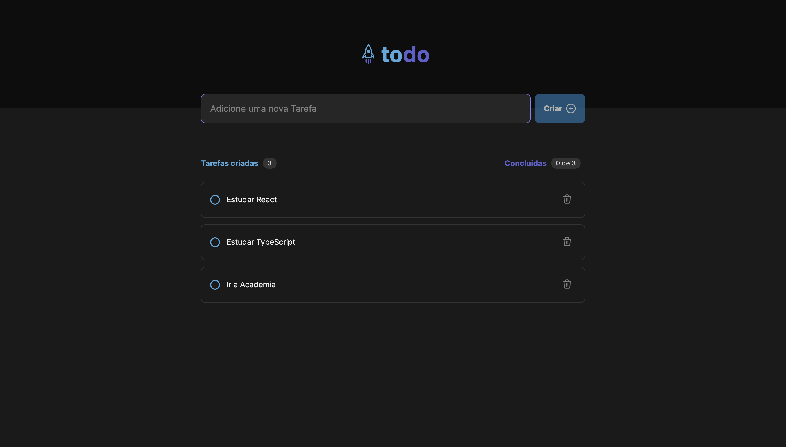

# Ignite-to-do

# 📸 Overview:


# 💻 Project:
### Desafio 01 do Ignite da Rocketseat

# 🚀 Technologies:
### ✔️ ReactJS
### ✔️ TypeScript
### ✔️ Vite

# How to run

```
# Clone this repository
$ git clone https://github.com/vinnycosta9898/ignite-to-do

# Go to the directory
$ cd ignite-to-do

# Install Dependencies
$ npm install

# Run Web Server
$ npm run dev